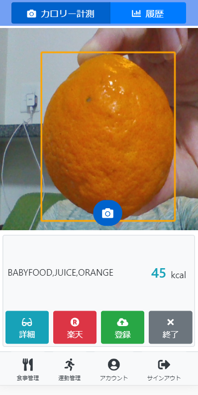
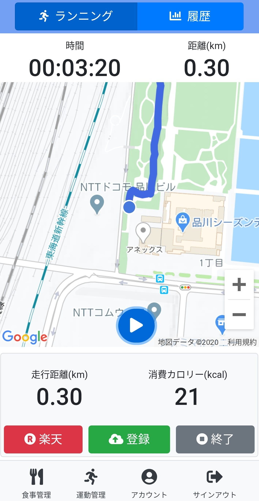
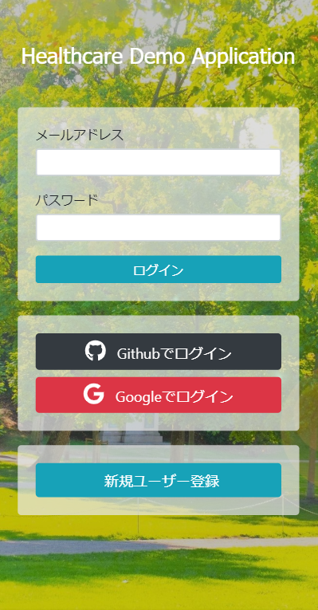

# Healthcare demo application

## 1. Overview

This is a health care application for my study. This application provides a meal and excercise support service. The demo site of this application is below.  
https://hc-demo-app-01.herokuapp.com/

### 1.1 Meal management

You can record the calories of the meal you eat by capturing with a camera.

### 1.2 Excercise management

This application supports your runnning habit. You can track your total running distance and calories burned. 

### 1.3 Singin/Signout

This application provides user/password and social login authentication.

## 2. Architecure

### 2.1 Frontend

* Use Vue/Nuxt(SSR) for view framework.

### 2.2 Backend

* Use Firebase for database and authentication platform.
* Use Google vision api for object detection api.

