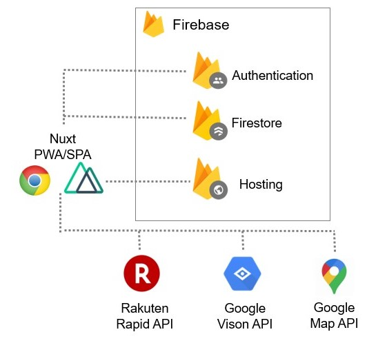

# Healthcare demo application

## 1. Overview

学習用に作成した PWA です。下記の機能を提供しています。

### 1. 食事管理

- カメラで食品の画像を撮影すると、そのカロリーがわかります。

### 1.2 Excercise management

- ランニングした距離と時間を計測できます。
-

### 1.3 Singin/Signout

- ユーザー/パスワードによるログイン以外に、Google と Github のアカウントでのログインも可能です

## 2. Architecure

### 2.1 Frontend

- Nuxt/Vue2 の SPA として実装しています。

### 2.2 Backend

- Firebase の認証機能(Authentication)やデータストア(Firestore)を利用しています。
- 画像の物体検知は Google の VisionAPI を利用しています。
